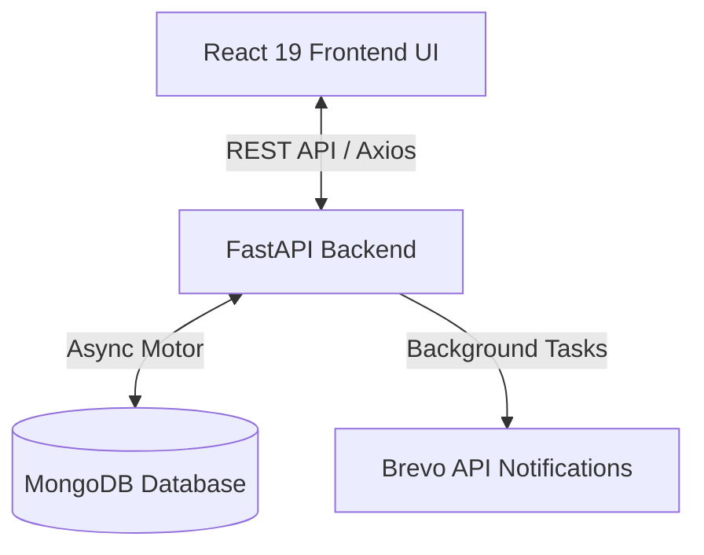

<div align="center">  
  <h1>🌾 AgriGear ERP</h1>
  <p><strong>Enterprise Resource Planning Platform for Agricultural Machinery Rental & Fleet Management</strong></p>
</div>

---

AgriGear ERP is a modern, full-stack, multi-tenant platform architected to manage the end-to-end lifecycle of agricultural machinery rental operations. From a farmer establishing bookings and an operator dispatching machinery, to a mechanic handling field maintenance, invoicing, payroll, and core business intelligence reporting—AgriGear acts as the central brain of an agricultural fleet.

---

## ✨ Enterprise Features

### 🏢 Multi-Tenant Architecture
Isolated, secure environments designed for scalability across multiple organizations.
- **Super Admin:** Provisions tenant organizations, manages active users, and global settings.
- **Owner:** Manages their distinct company space, registers managers, and monitors executive health dashboards.
- **Org Admin (Manager):** Handles day-to-day fleet assignments, local staff operations, and approvals.
- **Operator:** Logs field work, tracks machinery assignments, and records diesel/fuel usage.
- **Farmer:** Self-registers, browses machinery in a marketplace view, executes bookings, and views invoices.
- **Mechanic:** Independent or hired mechanics who receive maintenance requests, request spare parts, and log repairs.

### 🚜 Fleet & Machinery Tracking
- Global tracking for machinery inventory with isolated data per tenant.
- Geolocation tracking on active fields utilizing **Leaflet** maps.
- Advanced rate schemas: `Rate per Hour` vs `Rate per Acre`.
- Live machine status tracking: *Available, Booked, Under Maintenance.*

### 📋 Intelligent Bookings & Field Logging
- Farmers access a rich marketplace catalog to book required machinery dynamically.
- System-driven workflow: Create Booking → Admin assigns Operator → Operator logs actual completion.
- Automated creation of Invoices (for farmers) and Wage records (for operators/mechanics) upon closure of a job.

### 🔧 End-to-End Maintenance & Inventory
- Direct signaling for machinery breakdown from Operators to Admins.
- Mechanic assignment workflow with accept/reject SLA capabilities.
- Integrated Spare Parts approval workflow allowing cost tracking against specific machinery.

### 📊 Business Intelligence & Reporting
- **KPI Dashboard:** Top-level visualizations for Revenue, Bookings, Fleet Health, and active workflows.
- **Financial Breakdowns:** Profitability analysis calculating ROI per machine *(Revenue − Maintenance − Diesel − Wages)*.
- **Data Export:** Complete CSV export capabilities for accounting reconciliation.

---

## 🏗️ Architecture & Tech Stack

AgriGear ERP utilizes a robust separation of concerns, operating via a fast, reactive frontend communicating with a high-concurrency asynchronous backend.



### Stack Breakdown

| Layer | Technology | Key Libraries |
| --- | --- | --- |
| **Frontend** | React 19 | Tailwind CSS 3, Radix UI primitives, Recharts, React Hook Form, Leaflet |
| **Backend** | Python 3.10+ | FastAPI, Uvicorn, Pydantic v2, Passlib (bcrypt), python-jose (JWT) |
| **Database** | MongoDB | Motor (Asyncio Driver) |
| **Auth** | JWT / Bearer | Secure hashing, multi-role credential pipelines |

---

## 📁 Repository Structure

```text
agrigear-erp/
├── backend/                  # Python API Microservice
│   ├── server.py             # FastAPI App, Routes, Model definitions
│   ├── utils/                # Utility services (e.g., email dispatchers)
│   ├── requirements.txt      # Python dependencies
│   ├── .env                  # Backend environment secrets
│   └── run.bat               # Windows execution script
│
├── frontend/                 # React SPA Application
│   ├── src/                  
│   │   ├── api/              # Axios handlers & interceptors
│   │   ├── components/       # Reusable generic UI components (Buttons, Inputs)
│   │   ├── context/          # React Context (Auth Context)
│   │   ├── lib/              # Utility classes (clsx, tailwind-merge)
│   │   ├── pages/            # Role-based page views
│   │   └── App.js            # Router configuration & Entry
│   ├── package.json          # Node dependencies
│   ├── tailwind.config.js    # Design system tokens
│   └── .env                  # Frontend build variables
│
└── design_guidelines.json    # Shared design token constants
```

---

## 🚀 Deployment & Local Development

### 1. Prerequisites
Ensure the following are installed natively:
- **Python 3.10+**
- **Node.js 18+** & **Yarn 1.22+**
- **MongoDB** (Local instance running on `27017` or Atlas URI)

### 2. Database & Secrets Preparation

You must supply `.env` files for both applications. Ensure these are never committed to version control.

**Backend (`backend/.env`):**
```env
MONGO_URL=mongodb://localhost:27017
DB_NAME=agrigear_erp
CORS_ORIGINS=*
SECRET_KEY=your-secure-crypto-random-string
BREVO_API_KEY=your-brevo-api-key
BREVO_SENDER_EMAIL=your-email@yourdomain.com
SMTP_FROM_NAME=AgriGear ERP
FRONTEND_URL=http://localhost:3000
```

**Frontend (`frontend/.env`):**
```env
REACT_APP_API_URL=http://localhost:8000
```

### 3. Running the Application Locally

#### Start the Backend API
```bash
cd backend
python -m venv venv

# Windows
venv\Scripts\activate
# macOS/Linux
source venv/bin/activate

pip install -r requirements.txt

# Start Dev Server
python -m uvicorn server:app --reload --host 0.0.0.0 --port 8000
# Alternatively on Windows: run.bat
```
*The API Interactive documentation (Swagger UI) will mount at `http://localhost:8000/docs`.*

#### Start the Frontend Client
Open a secondary terminal:
```bash
cd frontend
yarn install
yarn start
```
*The React application will mount at `http://localhost:3000`.*

---

## 🔒 Security Posture

- **Role-Based Access Control (RBAC):** Every endpoint strictly enforces JWT payload role checks before database execution.
- **Tenant Isolation:** Database queries inherently filter by `organization_id` derived securely from the authenticated token payload.
- **Deferred Credentials:** Farmers and Mechanics register without passwords; credentials are automatically generated securely post-admin approval and dispatched via the Brevo API.
- **Secrets Management:** `.env` files and `__pycache__` artifacts are actively excluded via `.gitignore`.

---

## 📄 License
This project was built as an academic mini project.